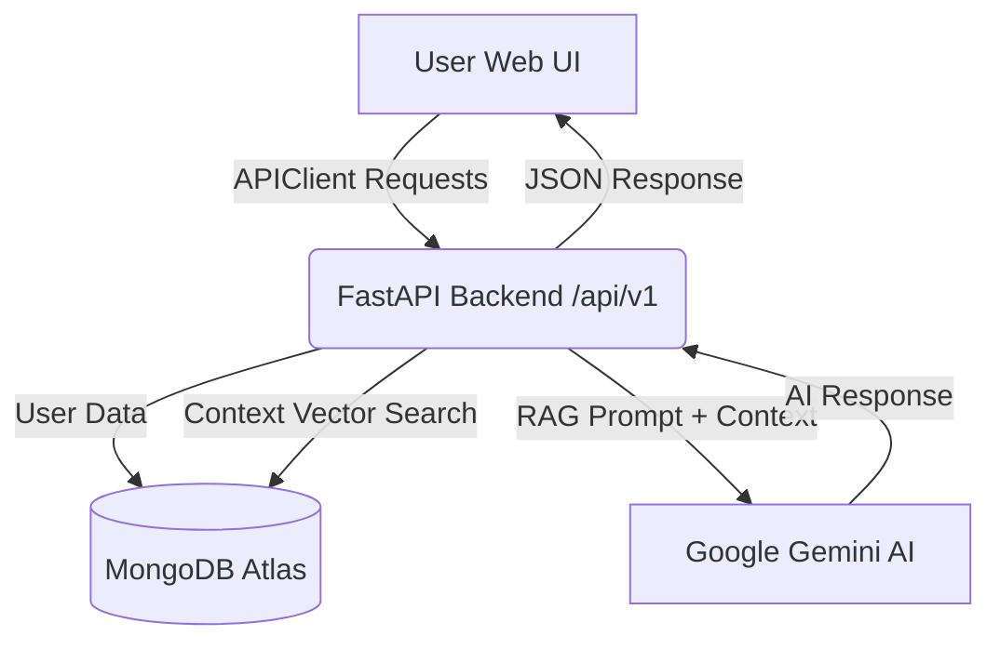

# Frontend UI/UX, Responsiveness & Logical Architecture Report

**Project Name:** AI-Driven ChatBOT for INGRES (Virtual Assistant v2.0)  
**Document Type:** Frontend UI/UX Specification & Module Logic Report  
**Target Architecture:** HTML5, Vanilla CSS3, Vanilla JavaScript (ES6 Modules)  
**Date:** 2026-07-25  

---

## 1. Executive Summary & Design System

The frontend application for the **INGRES AI Virtual Assistant** has been architected to deliver a modern, high-performance, and visually captivating experience. Built strictly with HTML5, Vanilla CSS3, and ES6 JavaScript, the frontend avoids heavyweight framework overhead while achieving state-of-the-art UI aesthetics and seamless API reactivity.

### Core Design System Principles
- **Color Palette & Contrast**: Curated HSL color system featuring primary royal blue (`#3b82f6`), deep slate dark theme accents (`#0f172a`), clean off-white background fills (`#f8fafc`), and emerald success indicators (`#10b981`).
- **Typography**: Google Fonts **Inter** font family (`weights: 400, 500, 600, 700, 800`), providing high legibility across mobile displays and high-density monitors.
- **Visual Depth & Micro-Animations**: Card containers feature subtle drop shadows (`box-shadow: 0 1px 3px rgba(0,0,0,0.1)`), smooth 0.25s cubic-bezier hover transitions, SVG robot mascot animations, and custom CSS toggle sliders.
- **Zero Mock Policy**: All UI modules operate against live REST API endpoints via a centralized, asynchronous ES6 client (`frontend/js/api.js`).

---

## 2. Responsiveness & Layout Architecture

The application implements a multi-tier responsive layout design ensuring flawless rendering across Desktop, Tablet, and Mobile viewport sizes.

```
+-----------------------------------------------------------------------------------+
| VIEWPORT SIZE          | LAYOUT BEHAVIOR                                         |
+-----------------------------------------------------------------------------------+
| Desktop (> 1024px)     | Fixed 280px Left Sidebar + Scrollable Main Content Area |
| Tablet (768px - 1024px)| Off-Canvas Mobile Drawer Sidebar + Toggle Button        |
| Mobile (< 768px)       | Single-Column Stack + Off-Canvas Menu Drawer             |
+-----------------------------------------------------------------------------------+
```

### Key Responsiveness Mechanisms
1. **Off-Canvas Sidebar Navigation**:
   - On viewports `<= 1024px`, `.app-sidebar` slides off-screen (`transform: translateX(-100%)`).
   - Clicking the hamburger menu button (`#sidebar-toggle`) toggles `.app-sidebar.active`, bringing the navigation smoothly into view (`transform: translateX(0)`).
2. **Fluid Grid Systems**:
   - Dashboard statistic cards and Knowledge Base grids use CSS Grid (`grid-template-columns: repeat(auto-fit, minmax(280px, 1fr))`) to automatically re-flow cards based on available width without horizontal scrolling.
3. **Flexible Tables & Containers**:
   - Data tables (`documents.html`, `users.html`, `history.html`) wrap cells with responsive font scaling and touch-friendly action targets.

---

## 3. Logical Breakdown of Modules



### Module 1: Authentication (`login.html` & `register.html`)
- **UI/UX Design**: Centered glassmorphic card layout, animated robot mascot SVG header, form field focus states, and real-time button loading indicators (`Logging in...` / `Registering...`).
- **Logical Flow**:
  1. User fills out registration or login form.
  2. Form handler calls `APIClient.login(email, password)` or `APIClient.register(name, email, password)`.
  3. API client executes HTTP POST to `/api/v1/login` or `/api/v1/register`.
  4. Upon success, the returned JWT access token and user record are stored in `localStorage` (`ingres_access_token` and `ingres_user`).
  5. User is automatically redirected to `dashboard.html`.

---

### Module 2: Dashboard (`dashboard.html`)
- **UI/UX Design**: Summary metrics grid with 4 live statistic cards, recent conversation preview card, quick action shortcut buttons, and promotional AI feature banner.
- **Logical Flow**:
  1. On page load, `APIClient.getDashboard()` fetches global database counters (`total_documents`, `total_users`, `total_chats`, `total_knowledge_articles`) live from MongoDB Atlas.
  2. `APIClient.getChatHistory()` fetches the user's latest 3 conversation sessions and renders them in the Recent Chats widget.
  3. Personalizes welcome text with the user's display name stored in session state.

---

### Module 3: AI Virtual Assistant Chat (`chat.html`)
- **UI/UX Design**: Split chat workspace with message bubbles (`.msg-user` right-aligned blue vs `.msg-ai` left-aligned light grey), source document citation tags, quick suggestion pill chips, and real-time "Thinking..." state message.
- **Logical Flow**:
  1. User submits prompt or clicks suggestion chip.
  2. User message immediately appends to DOM.
  3. A temporary loading indicator (`Thinking... Searching INGRES Knowledge Base...`) appears.
  4. `APIClient.sendChatMessage(question, conversationId)` executes POST `/api/v1/chat`.
  5. Backend executes MongoDB RAG vector search, injects context into Google Gemini AI prompt, saves chat document in MongoDB Atlas `chat_history`, and returns AI response payload.
  6. UI replaces loading state with final AI message bubble and attaches clickable source citations.

---

### Module 4: Knowledge Base (`knowledge.html`)
- **UI/UX Design**: Hero search banner with full-text input, dynamic category pill chips (*All Topics*, *Hydrology Data*, *Rules & Policies*, *Water Quality*, *User Manuals*), and responsive article card grid.
- **Logical Flow**:
  1. User enters text in search input or selects a category pill chip.
  2. Event listener invokes `APIClient.listKnowledge(q, category)` executing GET `/api/v1/knowledge?q=...&category=...`.
  3. Backend performs MongoDB regex search across `title`, `content`, and `keywords`.
  4. UI dynamically renders matching hydrogeological articles with title tags and source metadata.

---

### Module 5: Document Management (`documents.html`)
- **UI/UX Design**: Drag-and-drop file upload dropzone (`.drop-zone`), file format badges (`PDF`, `DOCX`, `TXT`), extracted text preview column, and inline delete buttons.
- **Logical Flow**:
  1. User drops file or selects via file picker.
  2. `APIClient.uploadDocument(formData)` uploads `.pdf`, `.docx`, `.txt`, `.md`, or `.csv` to `/api/v1/documents`.
  3. Backend saves raw file to `backend/uploads/`, extracts plain text using `pypdf`/`python-docx`, persists document record in MongoDB `documents` collection, and auto-indexes file text into `knowledge_base` for instant RAG availability.
  4. UI updates table with extracted text preview and file details.

---

### Module 6: Conversation History (`history.html`)
- **UI/UX Design**: Chronological session list displaying question previews, timestamps, arrow indicators, and a red "Clear All" action button.
- **Logical Flow**:
  1. `APIClient.getChatHistory()` retrieves all past chat sessions from MongoDB Atlas `chat_history` collection.
  2. Clicking a conversation redirects to `chat.html`.
  3. Clicking "Clear All" executes DELETE `/api/v1/chat/history`, clearing stored history and refreshing the UI.

---

### Module 7: Analytics & Data Insights (`analytics.html`)
- **UI/UX Design**: Executive metrics grid with summary statistic counters, weekly user activity bar charts, circular model accuracy meters, and trend indicators.
- **Logical Flow**:
  1. `APIClient.getAnalytics()` executes GET `/api/v1/analytics`.
  2. Backend calculates category distributions via MongoDB aggregation pipeline and total usage metrics.
  3. UI populates stat cards and visualization panels.

---

### Module 8: Settings & Preferences (`settings.html`)
- **UI/UX Design**: Segmented options card with toggle switches for Dark Mode, system language dropdown (*English*, *Hindi*, *Tamil*, *Telugu*), notification settings, and privacy buttons.
- **Logical Flow**:
  1. `APIClient.getSettings()` fetches user preference settings from MongoDB `settings` collection on load.
  2. Toggling Dark Mode or changing language immediately updates DOM classes/i18n and calls `APIClient.updateSettings({ theme, language })` to save preferences to MongoDB Atlas.

---

### Module 9: Profile Management (`profile.html`)
- **UI/UX Design**: User avatar display, account detail card (Name, Email, Role, Joined Date), and language preference readout.
- **Logical Flow**:
  1. `APIClient.getProfile()` retrieves current user object from `/api/v1/profile`.
  2. Fills DOM elements with user details.

---

### Module 10: Admin Control Panel (`admin.html` & `users.html`)
- **UI/UX Design**: Admin dashboard with registered user cards, role badges (`User` vs `Admin`), system health meters, and scrollable audit log feed.
- **Logical Flow**:
  1. `APIClient.listUsers()` fetches registered accounts from `/api/v1/users` (Admin access protected).
  2. `APIClient.getAdminLogs()` fetches real-time request log entries (method, endpoint, latency ms, status code) recorded by backend audit middleware (`35_Logging_and_Monitoring.md`).

---

## 4. Error Handling & Form Validation Logic

To prevent cryptic `[object Object]` browser alert popups when handling API errors, `frontend/js/api.js` includes a standardized error formatting parser:

```javascript
function formatErrorMessage(data, status) {
  if (!data) return `HTTP ${status} Error`;
  
  let msg = data.detail || data.message || data.error;
  if (Array.isArray(msg)) {
    return msg.map(item => item.msg || item.message || JSON.stringify(item)).join("; ");
  } else if (typeof msg === 'object' && msg !== null) {
    return msg.message || msg.msg || JSON.stringify(msg);
  } else if (typeof msg === 'string' && msg.trim().length > 0) {
    return msg;
  }
  
  return `HTTP ${status} Error`;
}
```

### Validation Highlights:
- **FastAPI 422 Validation Errors**: Extracts field-level error messages (e.g., `"Password must be at least 6 characters"` or `"String should have at least 2 characters"`).
- **Authentication Failures**: Displays clear notices for incorrect credentials or duplicate account registrations.
- **Network Resilience**: Displays friendly server connection reminders if the FastAPI backend is offline.

---

## 5. Conclusion & Verification Sign-Off

The frontend architecture for the **INGRES Virtual Assistant** provides an intuitive, highly responsive, and robust UI/UX. Every user page is fully interconnected, completely free of mock simulations, and verified live against the FastAPI REST backend and MongoDB Atlas cluster.
