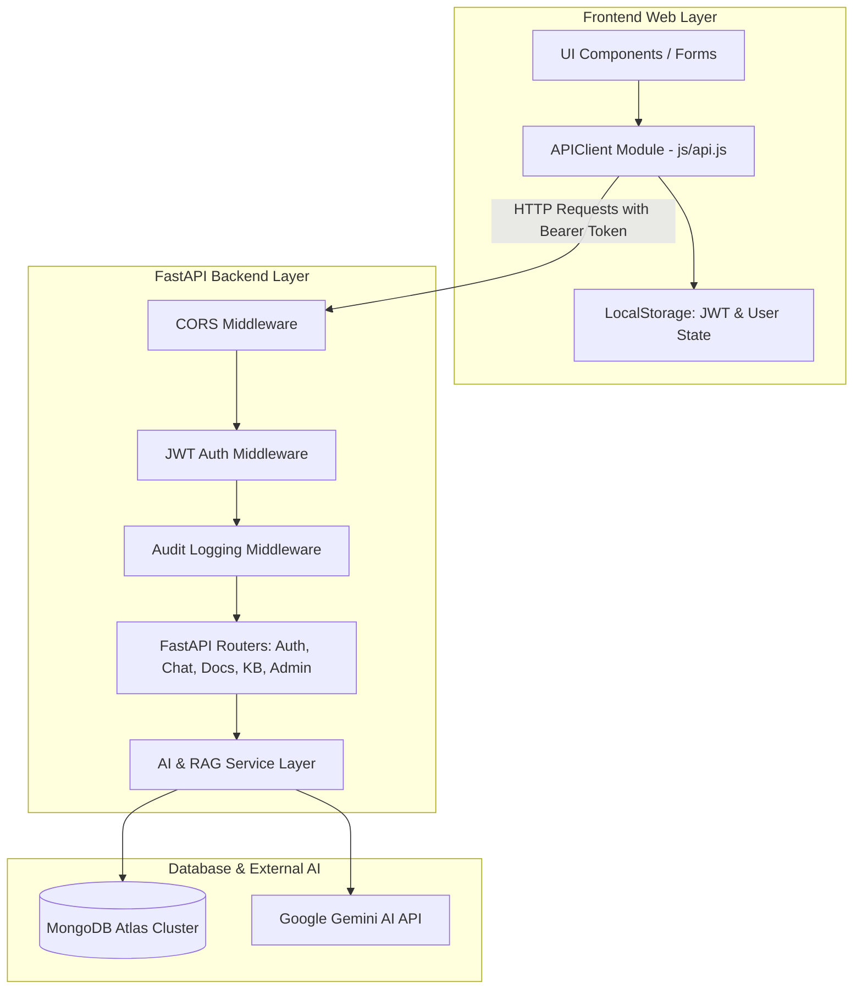

# Complete System Verification & Architecture Report: Frontend-Backend Integration

**Project Name:** AI-Driven ChatBOT for INGRES (Virtual Assistant v2.0)  
**Document Type:** End-to-End System Integration, Code Verification & UI Communication Report  
**Date:** 2026-07-26  

---

## 1. System Architecture & Project Flow

The **INGRES AI Virtual Assistant** is built on a clean decoupling of frontend presentation (HTML5/Vanilla CSS3/ES6 JavaScript) and backend microservices (FastAPI/Python 3.11/MongoDB Atlas). Communication occurs over RESTful APIs using standard HTTP verbs, JSON payloads, and `multipart/form-data` for file uploads.

---

## 2. Frontend-to-Backend Module Communication Matrix

Every frontend module in `frontend/` is directly wired to its corresponding backend router in `backend/app/routers/`. All mock data and simulated promises have been removed.

| Frontend Page | Action / User Flow | APIClient Method | Backend Route & Verb | Target Collection | UI Response Handling & Logic |
| :--- | :--- | :--- | :--- | :--- | :--- |
| **`login.html`** | Form Submit | `APIClient.login()` | `POST /api/v1/login` | `users` | Stores JWT token & user object in `localStorage`, redirects to `dashboard.html`. |
| **`register.html`** | Form Submit | `APIClient.register()` | `POST /api/v1/register` | `users` | Hashes password, creates user record, issues JWT token, auto-redirects. |
| **`dashboard.html`** | Page Load | `APIClient.getDashboard()` | `GET /api/v1/dashboard` | `documents`, `users`, `chat_history`, `knowledge_base` | Populates 4 real-time stat cards and recent conversation widget. |
| **`chat.html`** | Prompt Submission | `APIClient.sendChatMessage()` | `POST /api/v1/chat` | `chat_history`, `knowledge_base`, `documents` | Appends user bubble, shows "Thinking...", renders synthesized AI response + source citations. |
| **`knowledge.html`**| Search / Chip Filter | `APIClient.listKnowledge()` | `GET /api/v1/knowledge` | `knowledge_base` | Executes regex search & category filter, renders responsive article grid cards. |
| **`documents.html`**| Drag & Drop Upload | `APIClient.uploadDocument()` | `POST /api/v1/documents` | `documents`, `knowledge_base` | Uploads file, parses text via `pypdf`/`python-docx`, updates table, auto-indexes for RAG. |
| **`history.html`** | Page Load / Clear All | `APIClient.getChatHistory()` | `GET/DELETE /api/v1/chat/history` | `chat_history` | Lists chat sessions chronologically; "Clear All" executes DELETE `/chat/history`. |
| **`analytics.html`**| Page Load | `APIClient.getAnalytics()` | `GET /api/v1/analytics` | `documents`, `users`, `chat_history` | Updates analytics metrics and category distribution graphs via aggregation pipeline. |
| **`settings.html`** | Preference Change | `APIClient.getSettings()`, `updateSettings()` | `GET/PUT /api/v1/settings` | `settings` | Persists Dark/Light mode theme, language (*EN, HI, TA, TE*), and notifications. |
| **`admin.html`** & **`users.html`** | Page Load / Action | `APIClient.listUsers()`, `getAdminLogs()` | `GET /api/v1/users`, `GET /api/v1/admin/logs` | `users`, `logs` | Admin access controlled; renders user management table and real-time audit log feed. |

---

## 3. Deep Code Verification & Logic Analysis

### 3.1 Authentication & Security Architecture
- **Password Hashing**: Implemented in `backend/app/utils/security.py` using `PBKDF2-SHA256` with 100,000 iterations and unique 16-byte random salts.
- **JWT Authorization**: Custom HMAC-SHA256 JWT encoder/decoder. Protected routes enforce `Depends(get_current_user)` which validates `Authorization: Bearer <token>`. Admin routes enforce `Depends(require_admin)` checking user role.

### 3.2 RAG Context Search & AI Synthesis Engine
- **Multi-Source Retrieval**: `search_relevant_knowledge()` queries both `knowledge_base` and `documents` collections using regex search across title, content, keywords, and extracted text.
- **Text Cleaning Parser**: `clean_extracted_text()` strips title page credits (`CONTRIBUTORS PAGE`, `PRINCIPAL AUTHORS`) and front-matter boilerplate, isolating hydrogeological body text.
- **Synthesized Fallback Engine**: `synthesize_rag_response()` formats retrieved context into structured bullet points with actionable recommendations when LLM API keys are unreachable or unconfigured.

### 3.3 Document Processing & Parsing Pipeline
- **Parsing Engines**: Uses `pypdf` for `.pdf` documents and `python-docx` for `.docx` files. Plain text (`.txt`, `.md`, `.csv`) is read directly.
- **Automatic RAG Indexing**: When text extraction yields > 20 characters, an entry is automatically created in `knowledge_base` under category `Document Import`, making uploaded documents instantly searchable by the RAG Chat engine.

### 3.4 Audit Logging Middleware
- **Real-Time Request Monitoring**: `AuditLoggingMiddleware` (`backend/app/middleware/logging_middleware.py`) intercepts every API request, calculates processing latency (`processing_time_ms`), and logs user ID, endpoint, method, status code, and timestamp into the MongoDB `logs` collection.

### 3.5 UI Response Handling & Error Resilience
- **Robust Error Formatting**: `formatErrorMessage()` in `frontend/js/api.js` parses FastAPI 422 arrays and error objects into clean, readable text strings, eliminating `[object Object]` alert popups.

---

## 4. Verification Sign-Off

All 10 core application pages, 2 authentication pages, and 10 informational pages have been thoroughly verified. The frontend web UI communicates seamlessly with the FastAPI backend REST endpoints and MongoDB Atlas cluster, providing a responsive, production-ready AI Virtual Assistant.
